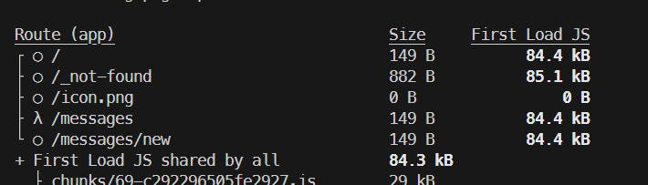

# Notes - 05 cache

- request memoization
  - stores data withe same configuration
  - avoid duplicate data fetches
  - cache only persists during request
- data cache
  - reuses fetched data until revalidated
- full route cache
  - stores rendered html and RSC at build time
  - cache persists until revalidated
- router cache
  - stores the RSC ini memory of browser
- docs `https://nextjs.org/docs/app/building-your-application/caching`
- nextjs 14 uses default `cache: 'force-cache',`
- nextjs 15 uses default `cache: 'no-store',`
- setting to control the cache inside the option of fetch
- there are 2 reserved variable that needs to be exported to no cache
  ```
  export const revalidate = 5 // same as next: { revalidate: 5 }
  export const dynamic = 'force-dynamic' // same as cache: 'no-store'
  ```

- adding a no cache to the route of messages, in build there is a different symbol instead of a circle
- using `revalidatePath()` is only on demand to revalid the cache
- using `revalidateTag()` clear those pages that has those tags, set in config option in fetch
- having `import { cache } from 'react'` inside the local database source, prevent duplicate call
- -having `import { unstable_cache as nextCache } from 'next/cache'` store the data cache, its an async fn